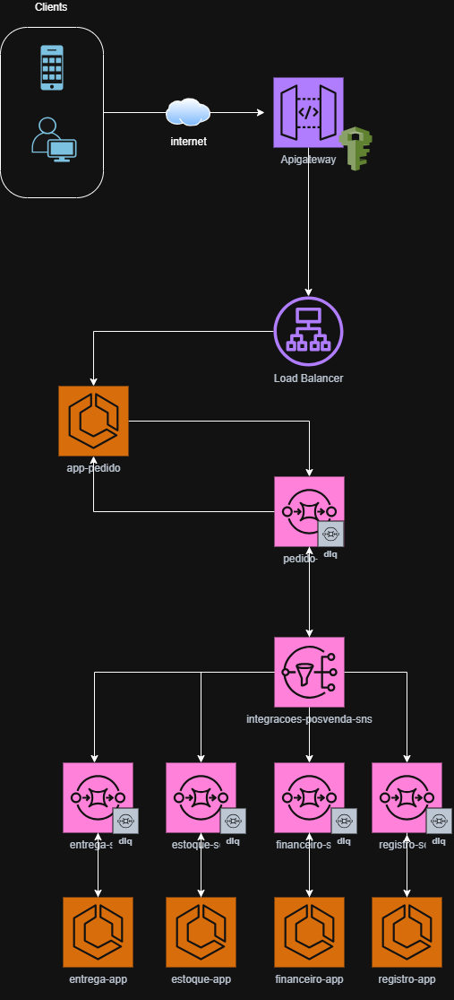

# Gerador de Nota Fiscal - Solução Event-Driven

Este projeto apresenta uma reengenharia completa do fluxo de processamento de notas fiscais, migrando de um modelo monolítico instável para uma **Arquitetura Orientada a Eventos (Event-Driven Architecture)**, utilizando serviços da AWS para garantir resiliência, escalabilidade e performance.

---

## 🏗️ Proposta de Arquitetura: Event-Driven

A arquitetura foi desenhada para resolver os gargalos de performance e inconsistência de dados através do desacoplamento total entre a recepção do pedido e as integrações de pós-venda.

### Desenho da Arquitetura

### Pilares da Solução
- **Desacoplamento via Pub/Sub (SNS + SQS)**: A adoção do padrão *Fan-out* permite que o evento de "Pedido Gerado" seja notificado a múltiplos domínios (Estoque, Financeiro, Entrega, Registro) de forma assíncrona. Se um serviço estiver indisponível, os outros seguem operando normalmente.
- **Resiliência e Recuperação (DLQ)**: Cada fila SQS de domínio possui uma *Dead Letter Queue* (DLQ) associada. Mensagens que falham após o esgotamento das políticas de *retry* são isoladas para análise, garantindo que nenhum dado seja perdido.
- **Tratamento de Integrações Lentas**: O processamento assíncrono remove o bloqueio da thread do usuário. O serviço de entrada apenas valida e publica o evento, enquanto os *workers* de cada domínio processam suas integrações de acordo com sua capacidade.
- **Segurança na Borda**: O uso do **API Gateway** com autenticação centralizada protege o ecossistema, garantindo que apenas requisições validadas entrem no fluxo de eventos.

---

## 🛠️ Tecnologias Principais
* **Core**: Java 21, Spring Boot 3.x
* **Event-Driven**: AWS SNS, AWS SQS
* **Resiliência**: Resilience4j (Retry Pattern)
* **Observabilidade**: Micrometer, Actuator, Prometheus
* **Infraestrutura**: Docker (Multi-stage build)

---

